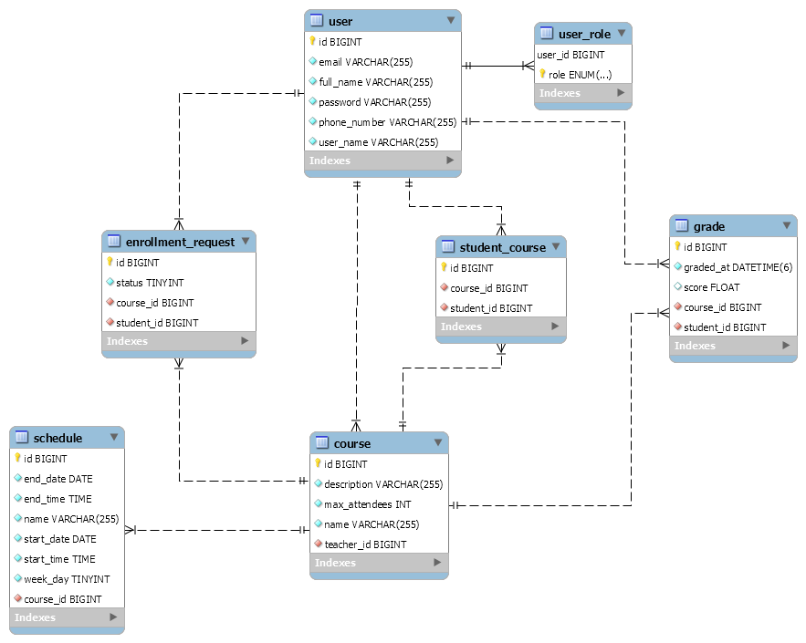

### Swagger
/swagger-ui/index.html

## Database Diagram

## Flows:
### 1. User Details
   create teacher_10
   create teacher_11 - username will be used for update to test validator
   login teacher_10
   see my details
   update my details
   update my details - invalid email
   update my details - invalid phone
   update my details - existing email
   update my details - existing username
   update my details - update username, parola
   re-login teacher_10
   update my details - email, phone number
   see my details (check that the new values are in the response body)

### 2. Course - Teacher
   create teacher_20
   login teacher_20
   create course_21
   create course_22 - invalid name, description, maxAttendees, schedules
   create course_22 - new schedules overlap eachother
   create course_22 - new schedules overlap existing schedules
   create course_22 - success
   get all created courses - not filtered by name (check count)
   get all created courses - filtered by name (check count)
   update course_22 - lower maxAttendees than current one
   update course_22 - success on name and maxAttendees

### 3. Schedules
   create teacher_30
   login teacher_30
   create course_31
   create course_32
   create schedule_30 - course not found
   create schedule_30 - invalid fields (all)
   create schedule_30 - endDate before startDate
   create schedule_30 - endTime before startTime
   create schedule_30 - overlaps with schedules from other courses students of this course are enrolled to
   create schedule_30 - success
   get all schedules (check count)
   update schedule_30 - success
   get all schedules for course (check count)

### 4. Enrollment Requests
   create teacher_41
   create student_41
   create student_42
   login teacher_41
   create course_41 - maxAttendees = 1
   create course_42 - maxAttendees > 1
   login student_41
   create enrollment request_41 - course not found
   create enrollment request_41 - course_41
   create enrollment request_42 - course_41 - invalid, already exists
   create enrollment request_42 - course_42 - invalid, overlap schedules
   login teacher_41
   update enrollment request_41 - to declined
   update enrollment request_41 - invalid update to pending
   update enrollment request_41 - to accepted
   update enrollment request_41 - invalid update to pending
   update enrollment request_41 - invalid update to declined
   login student_41
   create enrollment request_42 - course_42
   login student_42
   create enrollment request_43 - course_41 - invalid as Maximum Number Of Attendees id Reached
   create enrollment request_43 - course_42
   login teacher_41
   update enrollment request_43 - to accepted
   get enrollment requests for course_42 - no request param (check count)
   get enrollment requests for course_42 - status = PENDING (check count)
   get enrollment requests for course_42 - status = ACCEPTED (check count)
   delete enrollment request_43 - can't as the status is not pending
   login student_41
   get enrollment requests for me - no request param (check count)
   get enrollment requests for me - status = ACCEPTED (check count)
   get enrollment requests for me - status = PENDING (check count)
   delete enrollment request_42

### 5. After Enrollment Accept:
   create teacher_51
   create teacher_52
   login teacher_51
   create course_51
   create course_52
   login teacher_52
   create course_53
   create course_54
   create course_55
   create student_51
   create student_52
   login student_51
   create enrollment request_51 - course_51
   create enrollment request_52 - course_53
   login student_52
   create enrollment request_53 - course_53
   create enrollment request_54 - course_54
   create enrollment request_55 - course_55
   login teacher_51
   update enrollment request_51 - to accepted
   update enrollment request_52 - to accepted
   login teacher_52
   update enrollment request_52 - to accepted
   update enrollment request_53 - to accepted
   update enrollment request_54 - to accepted
   get enrolled students - course_53 - filter is null (check count)
   login student_52
   get all schedules for student (check count)
   get courses enrolled to - filter is null (check count)
   get course details - course_53 (check response values)
   get all courses (check count)

### 6.  Grade:
   create student_61
   create student_62
   create student_63
   create teacher_60
   login teacher_60
   create course_61
   create course_62
   login student_61
   create enrollment request_61 - course_61
   create enrollment request_62 - course_62
   login student_62
   create enrollment request_63 - course_61
   login student_63
   create enrollment request_64 - course_62
   login teacher_60
   update enrollment request_61
   update enrollment request_63
   update enrollment request_64
   create grade_61 - invalid fields
   create grade_61 - student_61 - course_63 - course not found
   create grade_61 - student_64 - course_61 - student not found
   create grade_61 - student_61 - course_62 - student not enrolled
   create grade_61 - student_61 - course_61
   create grade_62 - student_61 - course_61 - student already graded
   create grade_62 - student_62 - course_61
   create grade_62 - student_63 - course_62
   update grade_64 - grade not found
   update grade_61 - success
   get grades for course_61 - lowerBound null, upperBound null (check count)
   get grades for course_61 - lowerBound notNull, upperBound null (check count)
   get grades for course_61 - lowerBound null, upperBound notNull (check count)
   get grades for course_61 - lowerBound notNull, upperBound notNull (check count)
   get grade_61  (check response values)

### 7. Security:
   create student
   create teacher_71
   create teacher_72
   login student_70
   create course_70 - Forbidden
   login teacher_71
   create enrollment request_70 - Forbidden
   create course_71 - success
   login teacher_72
   update course_71 - Forbidden